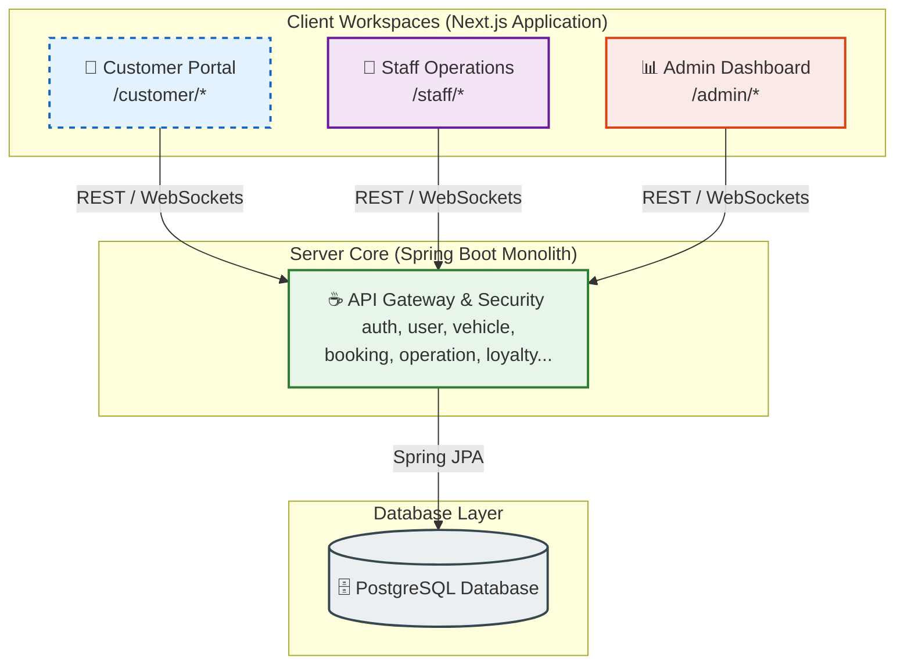

<p align="center">
  
  
  
  
  
  
  
</p>

<h1 align="center">🚗 AutoWash Pro / AURA CAR CARE</h1>
<p align="center">
  <strong>Hệ Thống Quản Lý &amp; Vận Hành Chuỗi Rửa Xe Tự Động Thông Minh</strong>
</p>

<p align="center">
  <a href="file:///d:/CarWash/.github/workflows/ci.yml"></a>
  <a href="file:///d:/CarWash/.github/dependabot.yml"></a>
  <a href="file:///d:/CarWash/.github/pull_request_template.md"></a>
  
</p>

---

## 📖 Giới thiệu Dự án
**AutoWash Pro** là giải pháp phần mềm toàn diện (Modular Monolith) giúp số hóa toàn bộ quy trình của một trung tâm dịch vụ chăm sóc xe hơi hiện đại. Hệ thống tích hợp đầy đủ từ việc khách đặt lịch trực tuyến, nhân viên vận hành tại quầy/khoang rửa xe, cho tới ban quản lý kiểm soát doanh thu, nhân sự và các chương trình khuyến mãi/ loyalty.

---

## 🧭 Kiến trúc Hệ thống & Phân hệ (Workspaces)

Hệ thống được thiết kế theo mô hình tách biệt ranh giới nghiệp vụ (Business Boundaries) với 3 phân hệ độc lập:



### 🔹 Phân hệ chính:
* **📱 [Customer Portal](file:///d:/CarWash/autowash-frontend/src/app/customer):** Dành cho khách hàng đặt lịch trực tuyến qua quy trình 7 bước tối ưu, quản lý danh sách xe, tích điểm nâng hạng thành viên (`MEMBER`, `SILVER`, `GOLD`, `PLATINUM`), đổi voucher khuyến mãi, và theo dõi tiến độ rửa xe trực tiếp.
* **🔧 [Staff Operations](file:///d:/CarWash/autowash-frontend/src/app/staff):** Giao diện Kanban board trực quan dành cho kỹ thuật viên điều phối hàng đợi xe (`PENDING` ➔ `CHECKED_IN` ➔ `IN_PROGRESS` ➔ `COMPLETED`), tích hợp bộ đếm giờ (Wash Timer) cho từng khoang rửa.
* **📊 [Admin Dashboard](file:///d:/CarWash/autowash-frontend/src/app/admin):** Trung tâm chỉ huy dành cho quản trị viên cấu hình dịch vụ, thiết lập chương trình khuyến mãi (Vouchers, Combos), phân công công việc cho nhân viên và theo dõi biểu đồ doanh thu (Recharts).

---

## 🛠️ Stack Công Nghệ & Thư viện Sử dụng

| Phân hệ | Công nghệ cốt lõi | Các thư viện nổi bật |
|---|---|---|
| **Frontend** | `Next.js 14 (App Router)` · `TypeScript` · `Tailwind CSS` | `Zustand` (State) · `TanStack Query v5` (API Cache) · `Axios` · `React Hook Form` + `Zod` · `Recharts` |
| **Backend** | `Spring Boot 3.3.5` · `Java 21` · `Spring Security` | `Spring Data JPA` · `JSON Web Token (JJWT)` · `Lombok` · `PostgreSQL Driver` |
| **DevOps & Tools** | `GitHub Actions` · `Dependabot` · `OpenAPI / Swagger` | Tự động hóa CI/CD, tự động vá lỗ hổng thư viện, tự động xuất tài liệu API. |

---

## 📂 Sơ đồ Thư mục Dự án

```text
CarWash/
├── .github/                          # Cấu hình GitHub Actions, Dependabot & PR Template
├── autowash-frontend/                # 💻 Mã nguồn Phân hệ Frontend (Next.js - FSD Architecture)
│   ├── public/                       # File tĩnh (Logo, hình ảnh...)
│   └── src/
│       ├── app/                      # Next.js App Router (Customer, Staff, Admin routing)
│       ├── entities/                 # Các thực thể nghiệp vụ (business entities: user, booking, loyalty...)
│       ├── features/                 # Các tính năng độc lập (auth, bookings, promotions, staff...)
│       └── shared/                   # Các thành phần dùng chung (UI components, API, utilities, store)
├── autowash-backend/                 # ☕ Mã nguồn Phân hệ Backend (Spring Boot)
│   ├── src/main/java/com/autowash/   # Package by layer: controller, service, repository, entity, dto, shared
│   └── pom.xml                       # Quản lý dependency Maven
└── docs/                             # 📚 Tài liệu kỹ thuật dự án
    ├── master/                       # PROJECT.md (Tài liệu gốc quy chuẩn dự án)
    ├── context/                      # Context chi tiết của Frontend và Backend
    └── specs/                        # Đặc tả hợp đồng API và hành vi Prototype
```

### Kiến trúc Frontend (Feature-Sliced Design - FSD)

Frontend được cấu trúc lại hoàn toàn theo chuẩn FSD nhằm dễ dàng mở rộng và bảo trì. Sơ đồ chi tiết như sau:

```text
autowash-frontend/src/
├── app/                      # 1. Lớp Routing: Next.js App Router (Phân trang Customer, Staff, Admin)
│   ├── (customer)/           # Định tuyến và Layout cho khách hàng
│   ├── (staff)/              # Định tuyến và Layout cho nhân viên
│   ├── (admin)/              # Định tuyến và Layout cho quản trị viên
│   └── globals.css           # Global styles
├── entities/                 # 2. Lớp Entities: Thực thể nghiệp vụ cốt lõi
│   ├── loyalty/              # Model, interface liên quan đến Loyalty
│   ├── promotions/           # Model, interface liên quan đến Promotions
│   └── user/                 # Model, interface liên quan đến User
├── features/                 # 3. Lớp Features: Tính năng, chức năng tương tác
│   ├── auth/                 # Tính năng Đăng nhập/Đăng xuất
│   ├── bookings/             # Tính năng Quản lý đặt lịch
│   ├── loyalty/              # Tính năng Tích điểm, lịch sử
│   ├── promotions/           # Tính năng Khuyến mãi, voucher
│   └── ...                   # (Các tính năng độc lập khác)
├── widgets/                  # 4. Lớp Widgets: Tổ hợp các feature thành block lớn (Header, Sidebar)
├── views/                    # 5. Lớp Views: Thành phần tổ hợp ra màn hình page hoàn chỉnh
├── shared/                   # 6. Lớp Shared: Thành phần tái sử dụng ở mọi nơi
│   ├── ui/                   # Design System (Shadcn UI components)
│   ├── lib/                  # Thư viện tiện ích (utils, API configs)
│   ├── store/                # Global State (Zustand)
│   └── types/                # Types dùng chung
└── middleware.ts             # Middleware xử lý Auth và Redirects
```

**Mô tả chi tiết các lớp:**
- **`app/`**: Chứa các file định tuyến (routing) của Next.js, phân chia rõ theo các roles (customer, staff, admin).
- **`entities/`**: Chứa định nghĩa kiểu dữ liệu (Types/Interfaces) và các logic lõi của các đối tượng nghiệp vụ (ví dụ: `CustomerPromotion`, `RedeemPointsRequest`).
- **`features/`**: Chứa logic xử lý, component, hooks và call API đặc thù cho từng chức năng (ví dụ: `bookings`, `loyalty`, `promotions`).
- **`widgets/` & `views/`**: Dùng để tổ hợp nhiều component từ features và entities thành một khối giao diện chức năng hoàn chỉnh.
- **`shared/`**: Các thành phần tái sử dụng ở mọi nơi bao gồm Hệ thống UI Design System (Shadcn UI), thư viện gọi API trung tâm, ngôn ngữ và global state (Zustand).

---

## 🚀 Hướng dẫn Cài đặt & Khởi chạy cục bộ (Local Setup)

### **1. Yêu cầu Môi trường**
* **Node.js** v18+
* **Java JDK** v21 (Khuyên dùng Eclipse Temurin hoặc OpenJDK)
* **Maven** v3.9+
* Cài đặt cơ sở dữ liệu **PostgreSQL** (hoặc hệ thống sẽ chạy ở chế độ kiểm thử H2 Database trong bộ nhớ).

### **2. Quy định cổng mặc định (Port Convention)**

> ⚠️ **Toàn bộ thành viên phải tuân thủ quy định cổng bên dưới để đảm bảo Frontend và Backend kết nối đúng khi chạy local.**

| Dịch vụ | Cổng mặc định | Địa chỉ truy cập |
|---|---|---|
| **Frontend (Next.js)** | `3000` | [http://localhost:3000](http://localhost:3000) |
| **Backend (Spring Boot)** | `8080` | [http://localhost:8080](http://localhost:8080) |
| **Backend API base path** | — | `http://localhost:8080/api/v1` |
| **Swagger UI** | — | [http://localhost:8080/swagger-ui.html](http://localhost:8080/swagger-ui.html) |
| **PostgreSQL** | `5432` | `jdbc:postgresql://localhost:5432/autowash` |

### **3. Cài đặt Backend** *(chạy trước)*
```bash
# Di chuyển vào thư mục Backend
cd autowash-backend

# Build và biên dịch ứng dụng
mvn clean install

# Chạy server Spring Boot (profile local sử dụng PostgreSQL)
mvn spring-boot:run "-Dspring-boot.run.profiles=local"
```
👉 Xem và test API qua Swagger UI tại: [http://localhost:8080/swagger-ui.html](http://localhost:8080/swagger-ui.html)

### **4. Cài đặt Frontend**
```bash
# Di chuyển vào thư mục Frontend
cd autowash-frontend

# Tạo file cấu hình local (chỉ cần làm 1 lần)
cp .env.example .env.local

# Cài đặt toàn bộ thư viện cần thiết
npm install

# Khởi chạy môi trường lập trình local
npm run dev
```
👉 Giao diện hiển thị tại: [http://localhost:3000](http://localhost:3000)

> **Lưu ý:** File `.env.local` đã được thêm vào `.gitignore` và sẽ KHÔNG bị push lên repository. Mỗi lập trình viên tự tạo file này từ `.env.example` khi clone dự án lần đầu.

---

## 🤝 Quy trình Hợp tác & Phát triển mã nguồn

Dự án áp dụng quy chuẩn làm việc nhóm khép kín nhằm bảo vệ tính ổn định của sản phẩm:

```text
Tạo nhánh mới (feature/*) ➔ Lập trình & Test cục bộ ➔ Push lên GitHub ➔ Tạo Pull Request (PR) 
     ➔ Chạy tự động CI Check (Build & Test) ➔ Reviewer phê duyệt ➔ Merge vào main/dev
```

* **Branch Protection:** Nhánh `main` và `dev` được khóa chặt qua GitHub Rulesets. Lập trình viên bắt buộc phải tạo PR và vượt qua các bài kiểm tra tự động trước khi code được gộp vào.
* **Mẫu mô tả PR:** Sử dụng [Mẫu PR chuẩn](file:///d:/CarWash/.github/pull_request_template.md) để ghi rõ mô tả thay đổi, cách test, và checklist tự kiểm tra chất lượng.
* **Hệ thống CI tự động:** GitHub Actions tự động kiểm tra lỗi biên dịch của Next.js Frontend và chạy Maven Test của Backend trên mỗi Pull Request.
* **Cập nhật bảo mật:** Dependabot quét các lỗ hổng thư viện hàng tuần và tự động tạo PR cập nhật các thư viện an toàn.

---

## 👥 Đội ngũ Phát triển (Development Team)

Dự án được nghiên cứu và thực hiện bởi nhóm sinh viên **Trường Đại học FPT TP.HCM**:

| MSSV | Họ và tên | Email liên hệ |
| :---: | :--- | :--- |
| **SE191116** | Hà Thúc Quốc Hùng | [htquochung.nt@gmail.com](mailto:htquochung.nt@gmail.com) |
| **SE192041** | Phạm Hoàng Gia Huy | [giahuy250349@gmail.com](mailto:giahuy250349@gmail.com) |
| **SE193449** | Lê Đoàn Gia Hưng | [lhung291005@gmail.com](mailto:lhung291005@gmail.com) |
| **SE194643** | Tống Vỹ Thuận | [tongvy900@gmail.com](mailto:tongvy900@gmail.com) |

---

## 📚 Liên kết Tài liệu hữu ích
* 📋 **Tài liệu gốc chuẩn của dự án:** [PROJECT.md](file:///d:/CarWash/docs/master/PROJECT.md)
* 💻 **Đặc tả logic Frontend:** [FRONTEND_CONTEXT.md](file:///d:/CarWash/docs/context/FRONTEND_CONTEXT.md)
* ☕ **Đặc tả nghiệp vụ Backend:** [BACKEND_CONTEXT.md](file:///d:/CarWash/docs/context/BACKEND_CONTEXT.md)
* 📖 **Đặc tả API Contracts:** [autowash_api_contracts.md](file:///d:/CarWash/docs/specs/autowash_api_contracts.md)

---
*Bản quyền phát triển © 2026 bởi nhóm sinh viên Trường Đại học FPT TP.HCM (FPT University HCMC). Bảo lưu mọi quyền.*
