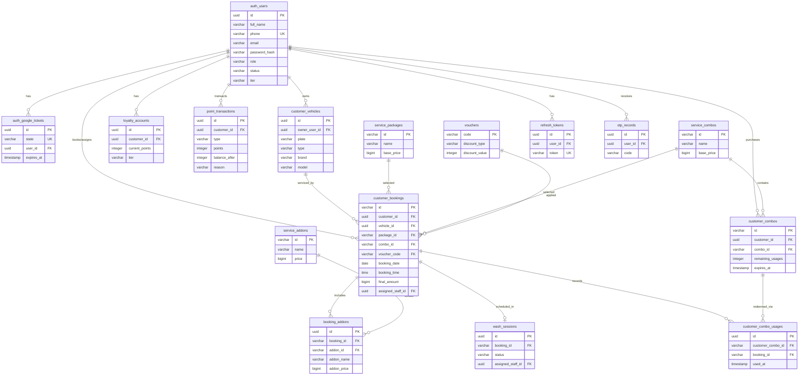

# Tài liệu Cấu trúc Database & Mối quan hệ thực thể (AutoWash)

Tài liệu này tổng hợp toàn bộ cấu trúc bảng và các câu lệnh khởi tạo (`CREATE TABLE`), thiết lập ràng buộc khóa ngoại (`FOREIGN KEY`) để thể hiện mối quan hệ giữa các thực thể trong hệ thống quản lý dịch vụ rửa xe **AutoWash**.

---

## 1. Sơ đồ mối quan hệ thực thể (ERD)

Dưới đây là sơ đồ mối quan hệ giữa các bảng chính trong hệ thống:



---

## 2. Các câu lệnh SQL Khởi tạo bảng (CREATE TABLE)

### 2.1 Bảng Người dùng & Xác thực

#### Bảng `auth_users` (Thông tin tài khoản)
```sql
CREATE TABLE public.auth_users (
    id uuid NOT NULL,
    full_name character varying(100) NOT NULL,
    phone character varying(10) NOT NULL,
    email character varying(255),
    password_hash character varying(255) NOT NULL,
    role character varying(20) NOT NULL,
    status character varying(20) NOT NULL,
    tier character varying(20) NOT NULL,
    is_new_customer boolean NOT NULL,
    created_at timestamp with time zone NOT NULL,
    updated_at timestamp with time zone NOT NULL,
    language character varying(10) DEFAULT 'VI'::character varying NOT NULL,
    theme character varying(20) DEFAULT 'LIGHT'::character varying NOT NULL,
    notifications_enabled boolean DEFAULT true NOT NULL,
    email_notifications boolean DEFAULT false NOT NULL,
    sms_notifications boolean DEFAULT true NOT NULL,
    auth_provider character varying(20) DEFAULT 'LOCAL'::character varying NOT NULL,
    oauth_subject character varying(255),
    email_verified boolean DEFAULT false NOT NULL,
    avatar_url character varying(500),
    CONSTRAINT auth_users_pkey PRIMARY KEY (id),
    CONSTRAINT auth_users_phone_key UNIQUE (phone)
);
```

#### Bảng `auth_google_tickets` (Xác thực Google OAuth)
```sql
CREATE TABLE public.auth_google_tickets (
    id uuid NOT NULL,
    state character varying(255) NOT NULL,
    return_url character varying(500) NOT NULL,
    status character varying(30) NOT NULL,
    provider_subject character varying(255),
    provider_email character varying(255),
    provider_full_name character varying(100),
    provider_avatar_url character varying(500),
    user_id uuid,
    expires_at timestamp with time zone NOT NULL,
    consumed_at timestamp with time zone,
    created_at timestamp with time zone NOT NULL,
    updated_at timestamp with time zone NOT NULL,
    CONSTRAINT auth_google_tickets_pkey PRIMARY KEY (id),
    CONSTRAINT auth_google_tickets_state_key UNIQUE (state)
);
```

#### Bảng `refresh_tokens` (Mã làm mới phiên đăng nhập)
```sql
CREATE TABLE public.refresh_tokens (
    id uuid NOT NULL,
    user_id uuid NOT NULL,
    token character varying(255) NOT NULL,
    expires_at timestamp with time zone NOT NULL,
    revoked_at timestamp with time zone,
    created_at timestamp with time zone NOT NULL,
    CONSTRAINT refresh_tokens_pkey PRIMARY KEY (id),
    CONSTRAINT refresh_tokens_token_key UNIQUE (token)
);
```

#### Bảng `otp_records` (Mã OTP xác minh)
```sql
CREATE TABLE public.otp_records (
    id uuid NOT NULL,
    user_id uuid NOT NULL,
    purpose character varying(50) NOT NULL,
    code character varying(255) NOT NULL,
    expires_at timestamp with time zone NOT NULL,
    attempts integer NOT NULL,
    verified boolean NOT NULL,
    created_at timestamp with time zone NOT NULL,
    delivery_address character varying(255) NOT NULL,
    invalidated_at timestamp with time zone,
    locked_at timestamp with time zone,
    CONSTRAINT otp_records_pkey PRIMARY KEY (id)
);
```

#### Bảng `otp_audit_logs` (Nhật ký xác thực OTP)
```sql
CREATE TABLE public.otp_audit_logs (
    id uuid NOT NULL,
    user_id uuid,
    purpose character varying(50) NOT NULL,
    event_type character varying(50) NOT NULL,
    delivery_address character varying(255),
    attempt_count integer NOT NULL,
    request_ip character varying(64),
    user_agent character varying(500),
    device_fingerprint character varying(255),
    message character varying(500),
    created_at timestamp with time zone NOT NULL,
    CONSTRAINT otp_audit_logs_pkey PRIMARY KEY (id)
);
```

---

### 2.2 Bảng Dịch vụ & Khuyến mãi (Catalog & Promotions)

#### Bảng `service_packages` (Gói rửa xe chính)
```sql
CREATE TABLE public.service_packages (
    id character varying(50) NOT NULL,
    name character varying(100) NOT NULL,
    description character varying(500),
    base_price bigint NOT NULL,
    duration_minutes integer NOT NULL,
    category character varying(30) NOT NULL,
    features_csv character varying(1000),
    image_url character varying(255),
    status character varying(20) NOT NULL,
    popularity character varying(20) NOT NULL,
    CONSTRAINT service_packages_pkey PRIMARY KEY (id)
);
```

#### Bảng `service_combos` (Gói combo định kỳ)
```sql
CREATE TABLE public.service_combos (
    id character varying(50) NOT NULL,
    name character varying(100) NOT NULL,
    description character varying(500),
    base_price bigint NOT NULL,
    duration_days integer NOT NULL,
    max_services integer NOT NULL,
    benefits_csv character varying(1000),
    image_url character varying(255),
    is_active boolean NOT NULL,
    can_upgrade boolean NOT NULL,
    upgrade_price_from bigint NOT NULL,
    CONSTRAINT service_combos_pkey PRIMARY KEY (id)
);
```

#### Bảng `service_addons` (Dịch vụ phụ trợ mua thêm)
```sql
CREATE TABLE public.service_addons (
    id character varying(50) NOT NULL,
    name character varying(100) NOT NULL,
    description character varying(500),
    price bigint NOT NULL,
    duration_minutes integer NOT NULL,
    category character varying(30) NOT NULL,
    image_url character varying(255),
    applicable_packages_csv character varying(500),
    status character varying(20) NOT NULL,
    CONSTRAINT service_addons_pkey PRIMARY KEY (id)
);
```

#### Bảng `vouchers` (Mã giảm giá)
```sql
CREATE TABLE public.vouchers (
    code character varying(50) NOT NULL,
    discount_type character varying(20) NOT NULL,
    discount_value integer NOT NULL,
    min_amount bigint NOT NULL,
    expires_at timestamp with time zone NOT NULL,
    active boolean NOT NULL,
    new_customer_only boolean NOT NULL,
    target_tiers_csv character varying(100),
    CONSTRAINT vouchers_pkey PRIMARY KEY (code)
);
```

#### Bảng `promotions` (Chiến dịch khuyến mãi)
```sql
CREATE TABLE public.promotions (
    id character varying(50) NOT NULL,
    name character varying(120) NOT NULL,
    description character varying(500),
    discount_type character varying(20) NOT NULL,
    discount_value integer NOT NULL,
    start_date timestamp with time zone NOT NULL,
    end_date timestamp with time zone NOT NULL,
    targeting_mode character varying(30) NOT NULL,
    applicable_tiers_csv character varying(100),
    max_usage_per_customer integer,
    status character varying(20) NOT NULL,
    created_at timestamp with time zone NOT NULL,
    updated_at timestamp with time zone NOT NULL,
    CONSTRAINT promotions_pkey PRIMARY KEY (id)
);
```

---

### 2.3 Bảng Khách hàng & Phương tiện

#### Bảng `customer_vehicles` (Phương tiện khách hàng)
```sql
CREATE TABLE public.customer_vehicles (
    id uuid NOT NULL,
    owner_user_id uuid NOT NULL,
    plate character varying(20) NOT NULL,
    type character varying(20) NOT NULL,
    brand character varying(50) NOT NULL,
    model character varying(50) NOT NULL,
    vehicle_year integer NOT NULL,
    color character varying(30),
    status character varying(20) NOT NULL,
    is_primary boolean NOT NULL,
    created_at timestamp with time zone NOT NULL,
    updated_at timestamp with time zone NOT NULL,
    deleted_at timestamp with time zone,
    CONSTRAINT customer_vehicles_pkey PRIMARY KEY (id)
);
```

#### Bảng `customer_combos` (Combo đã mua của khách)
```sql
CREATE TABLE public.customer_combos (
    id character varying(50) NOT NULL,
    customer_id uuid NOT NULL,
    combo_id character varying(50) NOT NULL,
    purchase_booking_id character varying(50),
    status character varying(20) NOT NULL,
    total_usages integer NOT NULL,
    remaining_usages integer NOT NULL,
    activated_at timestamp with time zone NOT NULL,
    expires_at timestamp with time zone NOT NULL,
    last_used_at timestamp with time zone,
    created_at timestamp with time zone NOT NULL,
    updated_at timestamp with time zone NOT NULL,
    CONSTRAINT customer_combos_pkey PRIMARY KEY (id)
);
```

---

### 2.4 Bảng Đặt lịch & Thực hiện dịch vụ (Bookings & Sessions)

#### Bảng `customer_bookings` (Đơn đặt rửa xe)
```sql
CREATE TABLE public.customer_bookings (
    id character varying(50) NOT NULL,
    customer_id uuid NOT NULL,
    vehicle_id uuid NOT NULL,
    package_id character varying(50),
    combo_id character varying(50),
    voucher_code character varying(50),
    booking_date date NOT NULL,
    booking_time time without time zone NOT NULL,
    payment_method character varying(30) NOT NULL,
    payment_status character varying(30) NOT NULL,
    status character varying(30) NOT NULL,
    base_price bigint NOT NULL,
    addons_total bigint NOT NULL,
    voucher_discount bigint NOT NULL,
    final_amount bigint NOT NULL,
    estimated_duration_minutes integer NOT NULL,
    created_at timestamp with time zone NOT NULL,
    cancelled_at timestamp with time zone,
    refund_amount bigint,
    refund_status character varying(30),
    cancel_reason character varying(500),
    points_redeemed integer DEFAULT 0 NOT NULL,
    points_discount bigint DEFAULT 0 NOT NULL,
    assigned_staff_id uuid,
    confirmation_status character varying(30) DEFAULT 'VERIFIED'::character varying NOT NULL,
    confirmation_expires_at timestamp with time zone,
    confirmed_at timestamp with time zone,
    CONSTRAINT customer_bookings_pkey PRIMARY KEY (id)
);
```

#### Bảng `booking_addons` (Dịch vụ kèm thêm của Booking)
```sql
CREATE TABLE public.booking_addons (
    id uuid NOT NULL,
    booking_id character varying(50) NOT NULL,
    addon_id character varying(50) NOT NULL,
    addon_name character varying(100) NOT NULL,
    addon_price bigint NOT NULL,
    CONSTRAINT booking_addons_pkey PRIMARY KEY (id)
);
```

#### Bảng `booking_otp_challenges` (Thử thách xác minh đơn đặt lịch)
```sql
CREATE TABLE public.booking_otp_challenges (
    id uuid NOT NULL,
    booking_id character varying(50) NOT NULL,
    code_hash character varying(255) NOT NULL,
    status character varying(30) NOT NULL,
    attempts integer NOT NULL,
    delivery_email character varying(255) NOT NULL,
    expires_at timestamp with time zone NOT NULL,
    sent_at timestamp with time zone NOT NULL,
    verified_at timestamp with time zone,
    invalidated_at timestamp with time zone,
    locked_at timestamp with time zone,
    dev_otp character varying(10),
    CONSTRAINT booking_otp_challenges_pkey PRIMARY KEY (id)
);
```

#### Bảng `booking_otp_audit_logs` (Nhật ký OTP đặt lịch)
```sql
CREATE TABLE public.booking_otp_audit_logs (
    id uuid NOT NULL,
    booking_id character varying(50) NOT NULL,
    event_type character varying(50) NOT NULL,
    attempt_count integer NOT NULL,
    delivery_email character varying(255),
    request_ip character varying(64),
    user_agent character varying(500),
    message character varying(500),
    created_at timestamp with time zone NOT NULL,
    CONSTRAINT booking_otp_audit_logs_pkey PRIMARY KEY (id)
);
```

#### Bảng `wash_sessions` (Phiên làm việc thực tế)
```sql
CREATE TABLE public.wash_sessions (
    id uuid NOT NULL,
    booking_id character varying(50) NOT NULL,
    status character varying(30) NOT NULL,
    notes character varying(500),
    fee_amount bigint,
    fee_currency character varying(10),
    projected_loyalty_points integer,
    awarded_loyalty_points integer,
    created_at timestamp with time zone NOT NULL,
    queued_at timestamp with time zone,
    checked_in_at timestamp with time zone,
    started_at timestamp with time zone,
    completed_at timestamp with time zone,
    assigned_staff_id uuid,
    CONSTRAINT wash_sessions_pkey PRIMARY KEY (id),
    CONSTRAINT wash_sessions_booking_id_key UNIQUE (booking_id)
);
```

#### Bảng `booking_staff_transfer_audits` (Lịch sử chuyển đổi nhân viên dịch vụ)
```sql
CREATE TABLE public.booking_staff_transfer_audits (
    id uuid NOT NULL,
    booking_id character varying(40) NOT NULL,
    wash_session_id uuid,
    from_staff_id uuid,
    to_staff_id uuid NOT NULL,
    actor_id uuid NOT NULL,
    reason character varying(500),
    created_at timestamp without time zone NOT NULL,
    CONSTRAINT booking_staff_transfer_audits_pkey PRIMARY KEY (id)
);
```

#### Bảng `customer_combo_usages` (Nhật ký dùng combo)
```sql
CREATE TABLE public.customer_combo_usages (
    id uuid NOT NULL,
    customer_combo_id character varying(50) NOT NULL,
    booking_id character varying(50) NOT NULL,
    used_at timestamp with time zone NOT NULL,
    service_date date NOT NULL,
    created_at timestamp with time zone NOT NULL,
    CONSTRAINT customer_combo_usages_pkey PRIMARY KEY (id)
);
```

---

### 2.5 Bảng Khách hàng Thân thiết (Loyalty System)

#### Bảng `loyalty_accounts` (Tài khoản tích điểm)
```sql
CREATE TABLE public.loyalty_accounts (
    id uuid NOT NULL,
    customer_id uuid NOT NULL,
    current_points integer NOT NULL,
    tier character varying(20) NOT NULL,
    created_at timestamp with time zone NOT NULL,
    updated_at timestamp with time zone NOT NULL,
    CONSTRAINT loyalty_accounts_pkey PRIMARY KEY (id),
    CONSTRAINT loyalty_accounts_customer_id_key UNIQUE (customer_id)
);
```

#### Bảng `point_transactions` (Lịch sử điểm tích lũy)
```sql
CREATE TABLE public.point_transactions (
    id uuid NOT NULL,
    customer_id uuid NOT NULL,
    type character varying(30) NOT NULL,
    points integer NOT NULL,
    balance_after integer NOT NULL,
    reason character varying(255) NOT NULL,
    reference_id character varying(100),
    created_at timestamp with time zone NOT NULL,
    CONSTRAINT point_transactions_pkey PRIMARY KEY (id),
    CONSTRAINT uq_point_transactions_type_reference UNIQUE (type, reference_id)
);
```

---

## 3. Các ràng buộc Khóa ngoại (Mối quan hệ thực thể)

Các câu lệnh thiết lập mối quan hệ giữa các bảng thông qua ràng buộc `FOREIGN KEY`:

```sql
-- Ràng buộc cho bảng: auth_google_tickets
ALTER TABLE ONLY public.auth_google_tickets
    ADD CONSTRAINT fk_auth_google_tickets_user FOREIGN KEY (user_id) REFERENCES public.auth_users(id);

-- Ràng buộc cho bảng: refresh_tokens
ALTER TABLE ONLY public.refresh_tokens
    ADD CONSTRAINT fk_refresh_tokens_user FOREIGN KEY (user_id) REFERENCES public.auth_users(id);

-- Ràng buộc cho bảng: otp_records
ALTER TABLE ONLY public.otp_records
    ADD CONSTRAINT fk_otp_records_user FOREIGN KEY (user_id) REFERENCES public.auth_users(id);

-- Ràng buộc cho bảng: otp_audit_logs
ALTER TABLE ONLY public.otp_audit_logs
    ADD CONSTRAINT fk_otp_audit_logs_user FOREIGN KEY (user_id) REFERENCES public.auth_users(id);

-- Ràng buộc cho bảng: customer_vehicles
ALTER TABLE ONLY public.customer_vehicles
    ADD CONSTRAINT fk_customer_vehicles_owner FOREIGN KEY (owner_user_id) REFERENCES public.auth_users(id);

-- Ràng buộc cho bảng: customer_combos
ALTER TABLE ONLY public.customer_combos
    ADD CONSTRAINT fk_customer_combos_combo FOREIGN KEY (combo_id) REFERENCES public.service_combos(id);
ALTER TABLE ONLY public.customer_combos
    ADD CONSTRAINT fk_customer_combos_customer FOREIGN KEY (customer_id) REFERENCES public.auth_users(id);

-- Ràng buộc cho bảng: customer_bookings
ALTER TABLE ONLY public.customer_bookings
    ADD CONSTRAINT fk_customer_bookings_assigned_staff FOREIGN KEY (assigned_staff_id) REFERENCES public.auth_users(id);
ALTER TABLE ONLY public.customer_bookings
    ADD CONSTRAINT fk_customer_bookings_combo FOREIGN KEY (combo_id) REFERENCES public.service_combos(id);
ALTER TABLE ONLY public.customer_bookings
    ADD CONSTRAINT fk_customer_bookings_customer FOREIGN KEY (customer_id) REFERENCES public.auth_users(id);
ALTER TABLE ONLY public.customer_bookings
    ADD CONSTRAINT fk_customer_bookings_package FOREIGN KEY (package_id) REFERENCES public.service_packages(id);
ALTER TABLE ONLY public.customer_bookings
    ADD CONSTRAINT fk_customer_bookings_vehicle FOREIGN KEY (vehicle_id) REFERENCES public.customer_vehicles(id);
ALTER TABLE ONLY public.customer_bookings
    ADD CONSTRAINT fk_customer_bookings_voucher FOREIGN KEY (voucher_code) REFERENCES public.vouchers(code);

-- Ràng buộc cho bảng: booking_addons
ALTER TABLE ONLY public.booking_addons
    ADD CONSTRAINT fk_booking_addons_addon FOREIGN KEY (addon_id) REFERENCES public.service_addons(id);
ALTER TABLE ONLY public.booking_addons
    ADD CONSTRAINT fk_booking_addons_booking FOREIGN KEY (booking_id) REFERENCES public.customer_bookings(id);

-- Ràng buộc cho bảng: booking_otp_challenges
ALTER TABLE ONLY public.booking_otp_challenges
    ADD CONSTRAINT fk_booking_otp_challenges_booking FOREIGN KEY (booking_id) REFERENCES public.customer_bookings(id);

-- Ràng buộc cho bảng: booking_otp_audit_logs
ALTER TABLE ONLY public.booking_otp_audit_logs
    ADD CONSTRAINT fk_booking_otp_audit_logs_booking FOREIGN KEY (booking_id) REFERENCES public.customer_bookings(id);

-- Ràng buộc cho bảng: wash_sessions
ALTER TABLE ONLY public.wash_sessions
    ADD CONSTRAINT fk_wash_sessions_assigned_staff FOREIGN KEY (assigned_staff_id) REFERENCES public.auth_users(id);
ALTER TABLE ONLY public.wash_sessions
    ADD CONSTRAINT fk_wash_sessions_booking FOREIGN KEY (booking_id) REFERENCES public.customer_bookings(id);

-- Ràng buộc cho bảng: booking_staff_transfer_audits
ALTER TABLE ONLY public.booking_staff_transfer_audits
    ADD CONSTRAINT fk_booking_staff_transfer_actor FOREIGN KEY (actor_id) REFERENCES public.auth_users(id);
ALTER TABLE ONLY public.booking_staff_transfer_audits
    ADD CONSTRAINT fk_booking_staff_transfer_booking FOREIGN KEY (booking_id) REFERENCES public.customer_bookings(id);
ALTER TABLE ONLY public.booking_staff_transfer_audits
    ADD CONSTRAINT fk_booking_staff_transfer_from_staff FOREIGN KEY (from_staff_id) REFERENCES public.auth_users(id);
ALTER TABLE ONLY public.booking_staff_transfer_audits
    ADD CONSTRAINT fk_booking_staff_transfer_session FOREIGN KEY (wash_session_id) REFERENCES public.wash_sessions(id);
ALTER TABLE ONLY public.booking_staff_transfer_audits
    ADD CONSTRAINT fk_booking_staff_transfer_to_staff FOREIGN KEY (to_staff_id) REFERENCES public.auth_users(id);

-- Ràng buộc cho bảng: customer_combo_usages
ALTER TABLE ONLY public.customer_combo_usages
    ADD CONSTRAINT fk_customer_combo_usages_booking FOREIGN KEY (booking_id) REFERENCES public.customer_bookings(id);
ALTER TABLE ONLY public.customer_combo_usages
    ADD CONSTRAINT fk_customer_combo_usages_customer_combo FOREIGN KEY (customer_combo_id) REFERENCES public.customer_combos(id);

-- Ràng buộc cho bảng: loyalty_accounts
ALTER TABLE ONLY public.loyalty_accounts
    ADD CONSTRAINT fk_loyalty_accounts_customer FOREIGN KEY (customer_id) REFERENCES public.auth_users(id);

-- Ràng buộc cho bảng: point_transactions
ALTER TABLE ONLY public.point_transactions
    ADD CONSTRAINT fk_point_transactions_customer FOREIGN KEY (customer_id) REFERENCES public.auth_users(id);
```

---

## 4. Các chỉ mục tối ưu hóa truy vấn chính (Key Indexes)

Dưới đây là một số Index quan trọng giúp tăng tốc độ truy vấn:
* **Đặt lịch theo trạng thái & nhân viên**: 
  `CREATE INDEX idx_customer_bookings_assigned_staff_status ON public.customer_bookings (assigned_staff_id, status);`
* **Đặt lịch theo khách hàng & thời gian**: 
  `CREATE INDEX idx_customer_bookings_customer_status_date ON public.customer_bookings (customer_id, status, booking_date, created_at);`
* **Phương tiện theo chủ sở hữu**: 
  `CREATE INDEX idx_customer_vehicles_owner_plate ON public.customer_vehicles (owner_user_id, plate);`
* **Lọc phiên làm việc theo trạng thái**: 
  `CREATE INDEX idx_wash_sessions_status_created_at ON public.wash_sessions (status, created_at);`
